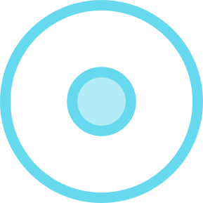

## Problem 1
::::::cols
::::col
- Your first task of the day is to recreate a Yin-Yang symbol, centered in the window, as seen to the right.
- At first glance, this may not look possible given the `GObject`s discussed so far in class, but clever layering of known shapes will get you there!
::::

::::col

<svg ViewBox="0 0 400 400" width=70%>
<rect width="400" height="400" fill="white" />
<circle cx="200" cy="200" r="160" />
<rect x="200" y="40" width="160" height="320" fill="white" />
<circle cx="200" cy="120" r="80" />
<circle cx="200" cy="280" r="80" fill="white" />
<circle cx="200" cy="280" r="20" />
<circle cx="200" cy="120" r="20" fill="white"/>
<circle cx="200" cy="200" r="160" fill="none" stroke-width="3" stroke="black"/>
</svg>

::::
::::::


## Try it! {data-state="DrawYinYangLayersTrace"}
<table style="margin:auto;">
<tbody style="border:none; background-color:#272822;">
<tr style="border:none; background-color:#272822; padding:0px;">
<td colspan=2 style="border:none; background-color:#272822; padding:0px;">
<div id="DrawYinYangCanvas" class="CTCanvas"
     style="border:none; background-color:#272822;"></div>
</td>
</tr>
<tr>
<td style="text-align:center; width:948px;">
<table class="CTControlStrip">
<tbody>
<tr>
<td>

</td>
<td>

</td>
</tr>
</tbody>
</table>
</td>
</tr>
</tbody>
</table>

## Possible Solution
```{.mypython style='max-height:800px'}
from pgl import GWindow, GRect, GOval

GW_WIDTH = 600
GW_HEIGHT = GW_WIDTH
RADIUS_L = 0.4 * GW_WIDTH
RADIUS_M = 0.5 * RADIUS_L
RADIUS_S = 0.25 * RADIUS_M

def draw_yinyang():
    """
    This function draws a yinyang symbol to the window
    """
    gw = GWindow(GW_WIDTH, GW_HEIGHT)
    cx = GW_WIDTH / 2
    cy = GW_WIDTH / 2

    # Large black circle
    c1 = GOval(2 * RADIUS_L, 2 * RADIUS_L)
    c1.set_filled(True)
    gw.add(c1, cx - RADIUS_L, cy - RADIUS_L)

    # White rectangle hiding right side
    r1 = GRect(RADIUS_L, 2 * RADIUS_L)
    r1.set_filled(True)
    r1.set_color("white")
    gw.add(r1, cx, cy - RADIUS_L)

    # Medium black upper circle
    c2 = GOval(2 * RADIUS_M, 2 * RADIUS_M)
    c2.set_filled(True)
    gw.add(c2, cx - RADIUS_M, cy - RADIUS_L)

    # Medium white lower circle
    c3 = GOval(2 * RADIUS_M, 2 * RADIUS_M)
    c3.set_filled(True)
    c3.set_color("white")
    gw.add(c3, cx - RADIUS_M, cy)

    # Small white upper circle
    c4 = GOval(2 * RADIUS_S, 2 * RADIUS_S)
    c4.set_filled(True)
    c4.set_color("white")
    gw.add(c4, cx - RADIUS_S, cy - RADIUS_M - RADIUS_S)

    # Small black lower circle
    c5 = GOval(2 * RADIUS_S, 2 * RADIUS_S)
    c5.set_filled(True)
    gw.add(c5, cx - RADIUS_S, cy + RADIUS_M - RADIUS_S)

    # Outline circle
    c6 = GOval(2 * RADIUS_L, 2 * RADIUS_L)
    c6.set_line_width(3)
    gw.add(c6, cx - RADIUS_L, cy - RADIUS_L)


if __name__ == "__main__":
    draw_yinyang()
```

## Problem 2 {data-state="StampSimTrace"}
::::::cols
::::col
<!--<video data-autoplay loop src="./images/stamping_demo.webm" />-->
<div id="StampCanvas" class="CTCanvas"
     style="border:none; background-color:white; width:800px; height:800px;"></div>
::::

::::{.col style='flex-grow:1.5'}
- Many graphical programs have a stamping tool, where clicking the mouse will "stamp" a shape onto the scene.
- Often, it is useful to have the shape of the stamp follow the user's cursor, so that the user can line it up exactly as they choose.
- In this problem, you want to recreate the program to the left, where clicking stamps a random shape (circle or square) in a random color to the screen.

::::
::::::

## Are you Listening?
- You need to accomplish two different forms of interaction in this problem:
  - Updating the position of the stamp to follow the user's cursor
  - Adding a new shape to the window when the user clicks
- This suggests you may want to be listening to two different events. What might be good choices?


## Considerations to Ponder
- Make sure your listeners and callback functions are working with print statements before you start adding graphics!
- The stamp should be centered on the cursor. How do you need to shift it to ensure this is so?
- You have a few methods you can use to update the position of an object. Which will be most useful in this case?
- You need to create a **new** object each time the stamp is clicked
  - How can you ensure it is a circle 50% of the time and a square 50% of the time?
  - How can you get it to be a random color?
  - When you add the new object to the window, it will appear on top of the stamp, which looks odd. How could you fix this?


## Possible Solution
```{.mypython style='max-height:800px; font-size:.75em'}
from pgl import GWindow, GRect, GOval
import random

GW_WIDTH = 800
GW_HEIGHT = 600
STAMP_SIZE = 50

def random_color():
    color = "#"
    for _ in range(6):
        color += random.choice("0123456789ABCDEF")
    return color

def stamper():

    def move_action(event):
        """
        Updates the location of the stamp to track
        the mouse. 
        """
        mx, my = event.get_x(), event.get_y()
        stamp.set_location(mx - STAMP_SIZE / 2, my - STAMP_SIZE / 2)

    def click_action(event):
        """ Stamps a new shape to the window. """
        mx, my = event.get_x(), event.get_y()
        if random.random() > 0.5:
            shape = GOval(mx - STAMP_SIZE / 2, my - STAMP_SIZE / 2,
                          STAMP_SIZE, STAMP_SIZE)
        else:
            shape = GRect(mx - STAMP_SIZE / 2, my - STAMP_SIZE / 2,
                          STAMP_SIZE, STAMP_SIZE)
        shape.set_filled(True)
        shape.set_color(random_color())
        gw.add(shape)
        # Need to add before can send backwards
        shape.send_backward()

    gw = GWindow(GW_WIDTH, GW_HEIGHT)

    # Initially making off screen
    stamp = GRect(-STAMP_SIZE, -STAMP_SIZE, STAMP_SIZE, STAMP_SIZE)
    stamp.set_filled(True)
    gw.add(stamp)

    gw.add_event_listener("mousemove", move_action)
    gw.add_event_listener("mousedown", click_action)


stamper()
```


## <i class="fa-solid fa-trophy fa-beat"></i> Challenge!
- Add a feature so that if the user clicks on previously stamped object, the color of that original object changes to some new random color
- In this case, a new object does **not** get created and added to the window. Only the color of the original shape is changed.


